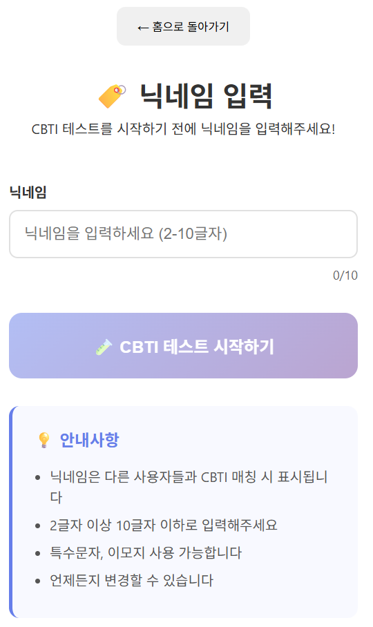
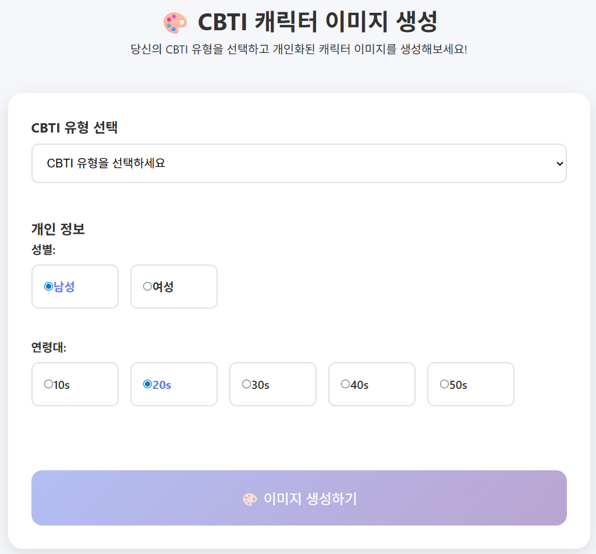
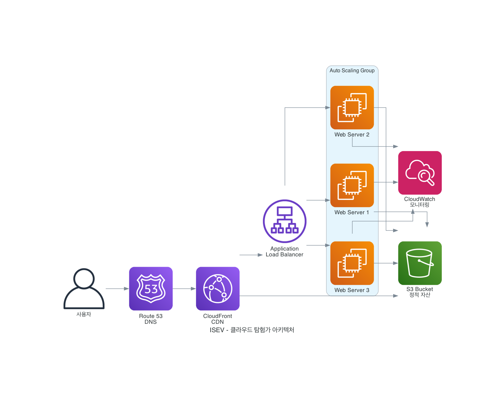
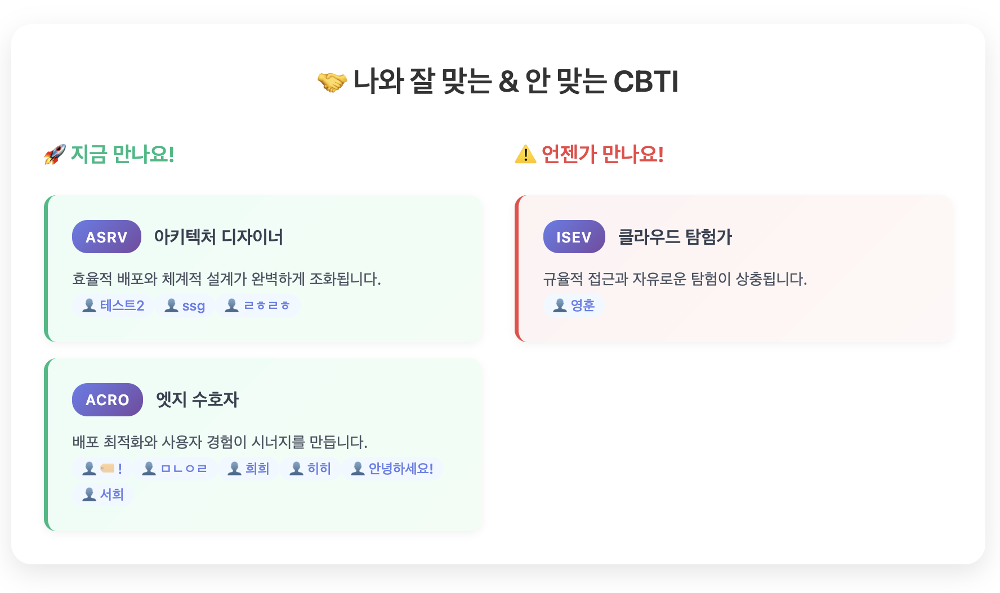

# Qloud : CBTI(Cloud-MBTI) 


## 어플리케이션 개요

**CBTI (Cloud-Based Type Indicator)**는 사용자의 클라우드 성향을 분석하여 16가지 유형으로 분류하는 혁신적인 웹 서비스입니다. 복잡한 클라우드 기술을 친근하고 이해하기 쉬운 성격 유형으로 변환하여, 클라우드 입문자부터 전문가까지 모든 사용자가 자신만의 클라우드 정체성을 발견할 수 있도록 돕습니다.

더 나아가 CBTI는 단순한 성향 분석을 넘어 매칭 시스템을 통해 호환성 높은 사용자들을 연결하고, 같은 CBTI 유형을 가진 사람들끼리 자연스럽게 네트워킹할 수 있는 플랫폼을 제공합니다. 클라우드라는 공통 관심사를 바탕으로 새로운 인맥을 만들고, 지식을 공유하며, 함께 성장할 수 있는 커뮤니티 공간을 만들어갑니다.


### 목적 및 핵심 가치

**개인화된 클라우드 여정 제공**
- 사용자의 성향에 맞는 AWS 서비스 학습 경로 제시
- 재미있는 테스트를 통한 클라우드 기술 이해도 향상
- 같은 유형의 사용자들 간의 네트워킹 및 커뮤니티 형성 지원

**과학적 분류 체계**
4개 차원으로 구성된 CBTI 유형 체계:
- **I/A**: 인프라 중심(Infrastructure) vs 애플리케이션 중심(Application)
- **S/C**: 서비스 지향(Service-oriented) vs 제어 중심(Control-focused)
- **E/R**: 탄력적(Elastic) vs 안정적(Reliable)
- **V/O**: 비전형(Visionary) vs 운영형(Operator)

**16가지 클라우드 성격 유형**
- **ISEV**: 클라우드 탐험가 - 새로운 구역을 보면 먼저 나침반부터 꺼내는 탐사형 빌더
- **ASEO**: 앱 오퍼레이터 - 제품을 오래 달리게 하는 숨은 드라이버, 현장감 넘치는 오퍼레이터
- **ICRV**: 보안 수호자 - 의심이 많지만 불편하지 않은, 좋은 보안의 집요한 설계자
- **ACEV**: 풀스택 개척자 - 한 손엔 화면, 다른 손엔 서버를 들고 끝까지 잇는 연결자
- 그 외 12가지 유형

## 주요 기능

### 1. 닉네임 기반 개인화 테스트


**사용자 여정**:
- 닉네임 입력 (2-10글자)
- 12개의 정교한 질문을 통한 클라우드 성향 분석
- 실시간 진행률 표시
- DynamoDB에 결과 자동 저장

**테스트 구성**:
- 실무 상황 기반 시나리오 질문
- 직관적인 UI/UX로 쉬운 답변 선택
- 개인화된 결과 제공

**예시 질문**:
```
"새로운 프로젝트를 시작할 때 어떤 것부터 하나요?"
A) 튼튼한 기초와 틀부터 만든다 (infra_focused)
B) 무엇을 만들지 아이디어부터 정한다 (app_focused)

"집을 짓는다면 어떤 방식을 선호하나요?"
A) 전문가에게 맡기고 편리하게 이용한다 (service_oriented)
B) 직접 설계하고 세세하게 조절한다 (control_focused)
```

**알고리즘**:
```typescript
// 각 trait별 점수 집계 후 우세한 trait 결정
const dimensions = [
  ['infra_focused', 'app_focused'],
  ['service_oriented', 'control_focused'], 
  ['elastic', 'reliable'],
  ['visionary', 'operator']
];
```

### 2. AI 기반 개인화 캐릭터 이미지 생성


**Amazon Bedrock Nova Canvas**를 활용한 맞춤형 캐릭터 생성:

**개인화 요소**:
- 사용자 정보(성별, 연령대) 기반 개인화
- CBTI 유형별 특성이 반영된 캐릭터 디자인
- 유형별 고유 심볼과 성격 특성 반영

**기술적 구현**:
```typescript
const generateImagePrompt = (userInfo, symbol, character) => {
  const genderEn = userInfo.gender === 'male' ? 'man' : 'woman';
  
  return `Keywords: ${userInfo.ageGroup} | ${userInfo.gender} | ${symbol} | ${character}
  High-quality 3D render in Pixar/DreamWorks style.
  The ${genderEn} must be holding a clear ${symbol} in their hand.
  Clean background, profile photo composition, 1024x1024 resolution.`;
};
```

**출력 품질**:
- 고품질 1024x1024 이미지 생성
- Pixar/DreamWorks 스타일 3D 렌더링
- 즉시 다운로드 가능

### 3. 맞춤형 AWS 아키텍처 추천


각 CBTI 유형별로 **최적화된 AWS 아키텍처**를 제공:

**제공 내용**:
- 16가지 유형별 전용 아키텍처 다이어그램
- 구현 가능한 CloudFormation 템플릿
- 상세한 서비스 설명 및 구성 가이드

**ISEV 유형 예시 (클라우드 탐험가)**:
```yaml
# 글로벌 확장 가능한 웹 서비스 아키텍처
Resources:
  CloudFrontDistribution:
    Type: AWS::CloudFront::Distribution
  ApplicationLoadBalancer:
    Type: AWS::ElasticLoadBalancingV2::LoadBalancer
  EC2AutoScalingGroup:
    Type: AWS::AutoScaling::AutoScalingGroup
    Properties:
      MinSize: 2
      MaxSize: 10
```

**추천 서비스 매핑**:
- **ISEV (클라우드 탐험가)**: CloudFront, ALB, EC2
- **ACEV (풀스택 개척자)**: EC2, S3, CloudFront
- **ICRV (보안 수호자)**: S3, CloudFront, WAF

### 4. 실시간 사용자 매칭 시스템


**DynamoDB 기반 실시간 매칭**:

**매칭 기능**:
- 🚀 **지금 만나요!**: 호환되는 CBTI 유형의 실제 사용자들
- ⚠️ **언젠가 만나요!**: 상충되는 CBTI 유형의 사용자들
- 닉네임과 CBTI 유형 실시간 표시

**기술적 구현**:
```typescript
// DynamoDB에서 호환 사용자 조회
const getCompatibleUsers = async (bestMatchTypes, worstMatchTypes) => {
  const response = await fetch('/api/cbti-matches', {
    method: 'POST',
    body: JSON.stringify({ bestMatchTypes, worstMatchTypes })
  });
  return response.json();
};
```

### 5. 컴포넌트별 전용 페이지

**모듈화된 사용자 경험**:

**페이지 구성**:
- **홈페이지**: CBTI 소개 및 다양한 진입점
- **닉네임 입력**: 개인화를 위한 사용자 정보 수집
- **테스트 페이지**: 12개 질문 기반 성향 분석
- **결과 페이지**: 실시간 사용자 매칭 및 호환성 분석
- **이미지 생성 페이지**: AI 기반 개인화 캐릭터 생성
- **아키텍처 페이지**: CBTI별 AWS 아키텍처 상세 분석


## 리소스 배포하기

### 사전 요구사항

**필수 도구 설치**
```bash
# Node.js 20 LTS
node --version  # v20.x.x 이상

# AWS CLI
aws --version   # aws-cli/2.x.x 이상

# Terraform
terraform --version  # Terraform v1.x.x 이상
```

**AWS 계정 설정**
1. **IAM 권한 설정**
   ```bash
   # 필요한 권한:
   # - AmazonS3FullAccess
   # - AWSElasticBeanstalkFullAccess
   # - CloudFormationFullAccess
   # - IAMFullAccess
   # - AmazonBedrockFullAccess
   # - AmazonSSMFullAccess
   # - AmazonDynamoDBFullAccess (신규 추가)
   ```

2. **AWS CLI 구성**
   ```bash
   aws configure
   # AWS Access Key ID: [액세스 키]
   # AWS Secret Access Key: [시크릿 키]
   # Default region name: us-east-1
   ```

3. **Bedrock 모델 활성화**
   - AWS 콘솔 → Amazon Bedrock → Model access
   - **Nova Canvas** 모델 활성화 필수

### 배포 방법

**방법 1: 자동 배포 스크립트 (권장)**
```bash
# 프로젝트 클론
git clone https://github.com/QloudTeam/Qloud09-aws-hackathon.git
cd Qloud09-aws-hackathon

# 인프라 배포
./scripts/deploy.sh production

# 의존성 설치
npm install

# 애플리케이션 빌드
npm run build

# EB 초기화 및 배포
eb init
=> Select a default region: 1
=> Select an application to use: qloud-terraform
=> Do you wish to continue with CodeCommit?: n

# EB 배포
eb deploy

```


### AWS 아키텍처

배포 완료 후 생성되는 **AWS 인프라 구조**:

```
┌─────────────────┐    ┌──────────────────┐    ┌─────────────────┐
│   사용자        │───▶│ Application      │───▶│ Amazon Bedrock  │
│   (브라우저)    │    │ Load Balancer    │    │ Nova Canvas     │
└─────────────────┘    └──────────────────┘    └─────────────────┘
                                │
                                ▼
                       ┌──────────────────┐
                       │ Elastic          │
                       │ Beanstalk        │
                       │ (Node.js 20)     │
                       │ + Express.js     │
                       └──────────────────┘
                                │
                    ┌───────────┼───────────┐
                    ▼           ▼           ▼
           ┌─────────────┐ ┌─────────┐ ┌─────────────┐
           │ Parameter   │ │DynamoDB │ │ CloudWatch  │
           │ Store       │ │ Table   │ │ Logs        │
           │(환경변수)   │ │(사용자) │ │(모니터링)   │
           └─────────────┘ └─────────┘ └─────────────┘
```

**생성되는 주요 리소스**
- **Elastic Beanstalk**: 애플리케이션 호스팅 (t3.micro)
  - Node.js 20 플랫폼
  - Express.js 서버 (server.js)
  - React SPA 정적 파일 서빙
- **Application Load Balancer**: 트래픽 분산 및 HTTPS 지원
- **S3 Bucket**: EB 버전 저장 (암호화 활성화)
- **DynamoDB Table**: 사용자 데이터 저장 (신규 추가)
  - 테이블명: `cbti-users`
  - GSI: `cbtiType-createdAt-index`
  - TTL: 30일 자동 삭제
- **Parameter Store**: 민감 정보 보안 저장
  - `/qloud/aws/access-key-id` (SecureString)
  - `/qloud/aws/secret-access-key` (SecureString)
  - `/qloud/aws/region` (String)
- **IAM Roles**: 최소 권한 원칙 적용 (DynamoDB 권한 포함)
- **CloudWatch**: 로그 및 모니터링

**배포 결과 확인**
```bash
cd terraform

# 배포된 리소스 정보 확인
terraform output

# 애플리케이션 URL 확인
terraform output -raw application_url
```

**예상 출력**:
```
application_url = "http://qloud-production.us-east-1.elasticbeanstalk.com"
environment_name = "qloud-production"
parameter_store_parameters = [
  "/qloud/aws/access-key-id",
  "/qloud/aws/secret-access-key",
  "/qloud/aws/region"
]
```

### 리소스 삭제

**자동 삭제 스크립트**
```bash
# 모든 리소스 삭제
bash scripts/destroy.sh production
```

**주의사항**:
- 삭제 전 중요한 데이터 백업 필수
- Parameter Store의 민감 정보는 별도 삭제 확인
- S3 버킷 내 파일은 수동 삭제 필요할 수 있음

## 프로젝트 기대 효과 및 예상 사용 사례

### 기대 효과

**1. 클라우드 교육 혁신**
- **학습 동기 부여**: 재미있는 성격 테스트로 클라우드 기술에 대한 관심 증대
- **개인화된 학습**: 각자의 성향에 맞는 AWS 서비스 학습 경로 제시
- **지식 정착**: 추상적인 클라우드 개념을 구체적인 성격 유형으로 체화

**2. 조직 내 클라우드 문화 확산**
- **팀 빌딩**: 구성원들의 클라우드 성향 파악을 통한 효율적인 역할 분담
- **의사소통 개선**: 공통된 언어(CBTI 유형)를 통한 원활한 소통
- **채용 및 배치**: 직무별 최적 CBTI 유형 매칭으로 인재 배치 최적화

**3. AWS 생태계 활성화**
- **서비스 인지도 향상**: 게임화된 방식으로 AWS 서비스 소개
- **실습 기회 제공**: CloudFormation 템플릿을 통한 실제 구현 경험
- **커뮤니티 형성**: 같은 유형 사용자들 간의 네트워킹 플랫폼

### 예상 사용 사례

**기업 및 조직**

**IT 교육 기관**
```
사용 시나리오: 클라우드 교육 과정 오리엔테이션
- 수강생들의 CBTI 테스트 실시
- 유형별 맞춤 커리큘럼 제공 (ISEV → 탐험적 학습, ICRO → 체계적 학습)
- 프로젝트 팀 구성 시 유형 고려 (ACEV + ASEO 조합으로 풀스택 팀 구성)
```

**스타트업 및 중소기업**
```
사용 시나리오: 클라우드 전환 프로젝트
- 팀원들의 클라우드 성향 파악
- 역할별 최적 인력 배치 (ICRV → 보안 담당, ASEO → 운영 담당)
- 클라우드 아키텍처 선택 가이드 (팀 구성에 따른 최적 AWS 서비스 조합)
- 내부 클라우드 챔피언 발굴 (ISEV, ACEV 유형 중심)
```

**교육 기관**

**대학교 컴퓨터공학과**
```
사용 시나리오: 클라우드 컴퓨팅 수업
- 학기 초 학생들의 성향 파악
- 개인별 맞춤 과제 및 프로젝트 제시
  * ICRV 유형 → 보안 중심 프로젝트
  * ASEV 유형 → 서버리스 애플리케이션 개발
- 학습자 간 스터디 그룹 매칭
```

**개인 사용자**

**클라우드 입문자**
```
사용 시나리오: 클라우드 학습 시작점
- 자신의 클라우드 성향 발견
- 적합한 AWS 서비스부터 학습 시작
  * ASEO 유형 → Elastic Beanstalk부터 시작
  * ICEV 유형 → EC2, VPC부터 시작
- 같은 유형의 전문가 멘토링 연결
```

**이벤트 및 컨퍼런스**

**AWS 사용자 그룹 밋업**
```
사용 시나리오: 아이스브레이킹 활동
- 참가자들의 CBTI 테스트 진행
- 유형별 테이블 구성으로 네트워킹
- 참가자 데이터 수집 및 분석 (클라우드 트렌드 파악)
- 발표 주제 선정 시 유형 고려
```

**🎉 CBTI로 당신만의 클라우드 여정을 시작하세요!**

*"모든 클라우드 전문가는 고유한 성향을 가지고 있습니다. CBTI가 당신의 클라우드 정체성을 찾아드립니다."*


